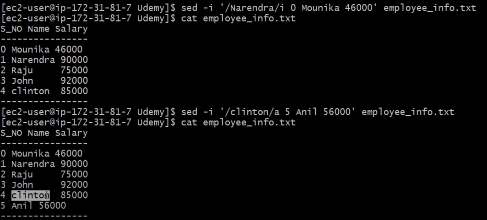
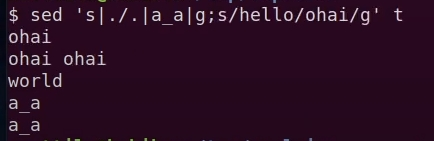

[Official sed page](https://www.gnu.org/software/sed/manual/sed.html)

## How to run  awk commands from a file
> `awk [options] -f file_name`

## options in awk
* **-v** : This option assigns a value to a variable. It allows assignment before the program execution. The following example describes the usage of the -v option. 
---

* **-f** : this options Reads  the  AWK  program source the file program-file, instead of the first command line argument.    Multiple -f (or --file) options maused
---
* **-e** : this option will run the inline code with awk
---

## Pattern in awk
* 

## How to run sed commands 
> `awk [options] 'commands' file_name`

```
# commands
i : insert a new line before given number
a : insert a new line after given number
d : delete a given line number
$ : used to insert content to the last line 
```
### Ex.



## How to change delimiters in sed 
> `# any character comes after s becomes the delimiter`  
> `sed 's//etc//' [filename]`  
> `sed 's./etc..' [filename]`


## How to change multiple things in single line in sed 
> `# we can use multiple regex in same line`  
> `sed 's./etc../g;s//' [filename]`




